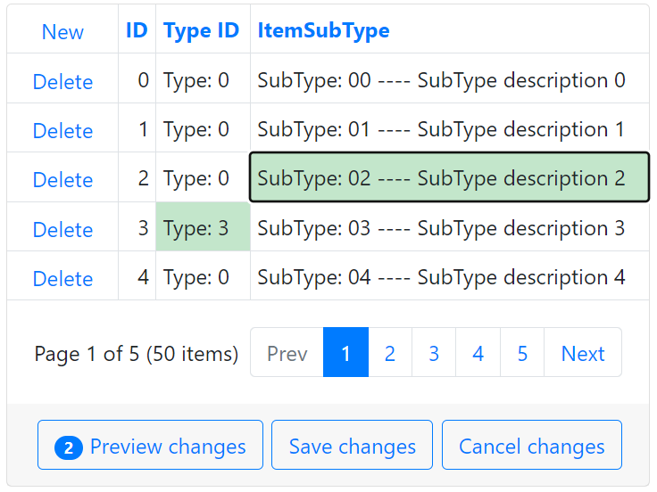

<!-- default badges list -->

[](https://supportcenter.devexpress.com/ticket/details/T828668)
[](https://docs.devexpress.com/GeneralInformation/403183)
<!-- default badges end -->
# Grid View for ASP.NET Bootstrap - How to initialize a combo box column in batch edit mode

This example demonstrates how to create a combo box column's edit item template to bind the column to a filtered data source and configure the grid's cell edit functionality in batch mode.



## Overview

Follow the steps below to initialize a combo box column in batch edit mode:

1. Add a [BootstrapGridView](https://docs.devexpress.com/AspNetBootstrap/DevExpress.Web.Bootstrap.BootstrapGridView) control to your page and populate it with columns.

2. Create a combo box column and specify its [PropertiesComboBox](https://docs.devexpress.com/AspNetBootstrap/DevExpress.Web.Bootstrap.BootstrapGridViewComboBoxColumn.PropertiesComboBox) settings for the view mode. To bind a combo box column to a data source, handle the column's [ItemRequestedByValue](https://docs.devexpress.com/AspNet/DevExpress.Web.ASPxComboBox.ItemRequestedByValue) and [ItemRequestedByFilterCondition](https://docs.devexpress.com/AspNet/DevExpress.Web.ASPxComboBox.ItemsRequestedByFilterCondition) events and filter the data source.

    ```aspx
    <dx:BootstrapGridViewComboBoxColumn FieldName="YourFieldName" ...>
        <PropertiesComboBox ValueField="YourFieldName"	OnItemRequestedByValue="OnItemRequestedByValue_View"
        OnItemsRequestedByFilterCondition="OnItemsRequestedByFilterCondition_View" TextFormatString="{0}|{1}...">
            <Fields>
            <!-- ... -->
            </Fields>
        </PropertiesComboBox>
        <!-- ... -->
    </dx:BootstrapGridViewComboBoxColumn>
    ```

    ```cs
    protected void OnItemRequestedByValue_View(object source, ListEditItemRequestedByValueEventArgs e) {
        if (e.Value == null) return;
        int subTypeID = (int)e.Value;
        BootstrapComboBox editor = source as BootstrapComboBox;
        editor.DataSource = ItemTypeFactory.GetItemSubTypes().Where(s => s.SubTypeID == subTypeID);
        editor.DataBind();
    }
    protected void OnItemsRequestedByFilterCondition_View(object source, ListEditItemsRequestedByFilterConditionEventArgs e) {
        BootstrapComboBox editor = source as BootstrapComboBox;
        editor.DataSource = ItemTypeFactory.GetItemSubTypes().Where(s => s.SubTypeDescription.Contains(e.Filter)
        || s.SubTypeName.Contains(e.Filter)
        || s.SubTypeID.ToString().Contains(e.Filter));
        editor.DataBind();
    }
    ```

3. Specify the column's [EditItemTemplate](https://docs.devexpress.com/AspNet/DevExpress.Web.GridViewDataColumn.EditItemTemplate) property, add a [BootstrapComboBox](https://docs.devexpress.com/AspNetBootstrap/DevExpress.Web.Bootstrap.BootstrapComboBox) control to the template to use it in edit mode, and enable its [EnableCallbackMode]() property. Handle the combo box's server-side [ItemsRequestedByFilterCondition](https://docs.devexpress.com/AspNet/DevExpress.Web.ASPxComboBox.ItemsRequestedByFilterCondition) and [ItemRequestedByValue](https://docs.devexpress.com/AspNet/DevExpress.Web.ASPxComboBox.ItemRequestedByValue) events and filter the data source based on the values of other fields. 

    ```aspx
    <dx:BootstrapGridViewComboBoxColumn Caption="ItemSubType" FieldName="SubTypeID" VisibleIndex="4">
        <!-- ... -->
        <EditItemTemplate>
            <dx:BootstrapComboBox ID="bsCombobox" runat="server" EnableCallbackMode="true" ClientInstanceName="bsCombobox" OnItemRequestedByValue="OnItemRequestedByValue" OnItemsRequestedByFilterCondition="OnItemsRequestedByFilterCondition" ValueField="SubTypeID" TextFormatString="SubTypeID: {0} ---- Desription: {1}">
                <Fields>
                    <!-- ... -->
                </Fields>
                <ClientSideEvents LostFocus="bsCombobox_LostFocus" />
            </dx:BootstrapComboBox>
        </EditItemTemplate>
    </dx:BootstrapGridViewComboBoxColumn>
    ```

    ```cs
    protected void OnItemRequestedByValue(object source, ListEditItemRequestedByValueEventArgs e) {
        // ...
        int typeID = GetCurrentItemTypeID();
        List<SubType> subTypes;
        if (typeID > -1)
            subTypes = ItemTypeFactory.GetItemSubTypes().Where(s => s.TypeID == typeID && s.SubTypeID.ToString() == id).ToList();
        // ...
        editor.DataSource = subTypes;
        editor.DataBind();
    }

    protected void OnItemsRequestedByFilterCondition(object source, ListEditItemsRequestedByFilterConditionEventArgs e) {
        BootstrapComboBox editor = source as BootstrapComboBox;
        int typeID = GetCurrentItemTypeID();
        List<SubType> subTypes;
        if (typeID > -1)
            subTypes = ItemTypeFactory.GetItemSubTypes().Where(s => s.TypeID == typeID && (s.SubTypeDescription.Contains(e.Filter)
            // ...
        editor.DataSource = subTypes;
        editor.DataBind();
    }
    ```

4. To initialize the combo box control on the client, handle the grid's `BatchEditStartEditing` and `BatchEditEndEditing` events as demonstrated in the following example: [Grid View for ASP.NET Web Forms - How to implement an edit item template in batch mode](https://github.com/DevExpress-Examples/asp-net-web-forms-grid-edit-item-template-in-batch-mode).

    ```js
    function OnBatchEditStartEdit(s, e) {
        var currentTypeID = grid.batchEditApi.GetCellValue(e.visibleIndex, 'TypeID');
        var cellInfo = e.rowValues[ColIndexByName('SubTypeID')];
        this.setTimeout(function () {
        bsCombobox.SetValue(cellInfo.value);
        bsCombobox.SetText(cellInfo.text);
        }, 0);
        RefreshData(currentTypeID);
    }
    function OnBatchEditEndEdit(s, e) {
        var cellInfo = e.rowValues[ColIndexByName('SubTypeID')];
        cellInfo.value = bsCombobox.GetValue();
        cellInfo.text = bsCombobox.GetText();
        bsCombobox.SetValue(null);
    }
    ```

5. To pass the new field value to the server, use a hidden field control and call the combo box's `PerformCallback` method.

    ```js
    function RefreshData(currentTypeID) {
        hf1.Set('currentTypeID', currentTypeID);
        bsCombobox.PerformCallback();
    }
    ```

## Files to Review

* [Default.aspx](./CS/WebSite/Default.aspx) (VB: [Default.aspx](./VB/WebSite/Default.aspx))
* [Default.aspx.cs](./CS/WebSite/Default.aspx.cs) (VB: [Default.aspx.vb](./VB/WebSite/Default.aspx.vb))

## Documentation

* [Batch Edit Mode](https://docs.devexpress.com/AspNetBootstrap/118184/grid-view/data-editing/batch-edit-mode)

## More Examples

* [Grid View for ASP.NET Web Forms - How to implement an edit item template in batch mode](https://github.com/DevExpress-Examples/asp-net-web-forms-grid-edit-item-template-in-batch-mode)
